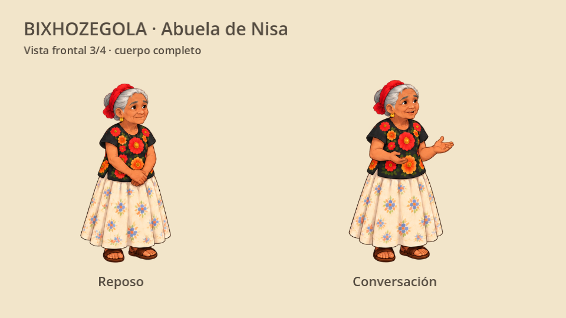
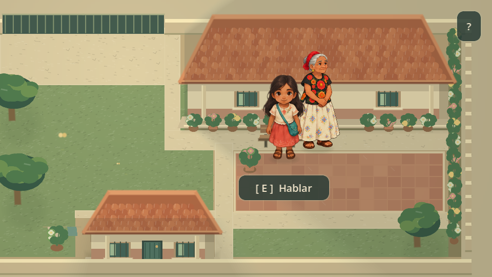

# Diseño de Bixhozegola

La abuela de Nisa usa ilustraciones cálidas con proporciones adultas, rostro alargado y arrugas, manos delgadas, cabello canoso recogido y postura suavemente encorvada. La silueta combina blusa negra de flores grandes, falda larga crema con motivos suaves y sandalias sencillas. El detalle rojo del cabello y los aretes pequeños mantienen los accesorios discretos.

## Alcance narrativo

Bixhozegola permanece junto al banco y transmite recuerdos mediante conversaciones. En esta etapa necesita cuerpo completo en vista frontal 3/4, reposo y un gesto al hablar. No se añaden caminatas ni giros sin una escena que los requiera. El recurso `SpriteFrames` permite incorporar después las otras direcciones conservando el diseño.

El contraste con Nisa es generacional: la niña tiene cabeza más grande, falda coral y morral turquesa; la abuela tiene proporciones más naturales, cabello canoso, blusa oscura y falda larga clara.

## Recursos y encuadre

- `assets/characters/bixhozegola/bixhozegola_atlas.png`: PNG transparente de 1536×1024, seis fotogramas.
- `sprite_frames.tres`: `idle_down`, tres fotogramas a 2 FPS; `talk_down`, tres a 3 FPS. Ambas animaciones se repiten.
- `atlas_layout.json`: regiones del atlas, márgenes y referencias del suelo. Los márgenes de `AtlasTexture` alinean los dibujos sin modificar los píxeles originales.
- Cada fotograma ocupa un lienzo virtual de 320×544; el origen entre los pies es `(160, 512)`. La altura dibujada ronda 86 unidades del mundo; solamente el hijo visual se escala.
- `scripts/presentation/bixhozegola_art.gd` crea `AnimatedSprite2D` y lee las líneas existentes que comienzan con `Bixhozegola:`. Cuando Nisa habla, la abuela escucha en reposo. Su animación se pausa al salir del patio.

El punto `FAMILY_POSITION`, los textos, los objetivos, el movimiento, las colisiones y el guardado conservan su implementación. La presentación se integra en el orden por Y compartido con Nisa y Gela. El patio antiguo de comparación conserva su arte provisional.

## Generación y referencias

Arte generado con ImageGen usando la lámina proporcionada por el usuario y el diseño de Nisa como referencias. Los prompts y refinamientos están en [generation_prompt.md](../assets/characters/bixhozegola/generation_prompt.md). Las capturas proceden del renderizador de Godot.

La vestimenta es una propuesta artística, no documentación cultural. Verificar los bordados, el peinado, el uso cotidiano de las prendas y el nombre provisional con hablantes y fuentes de comunidades específicas del Istmo. Los rótulos de la lámina no acreditan esas atribuciones; no se inventan traducciones.

## Verificación

Ejecuta `godot --headless --path . --script res://tests/test_bixhozegola_art.gd`. Comprueba encuadre, transparencia, turnos de voz, interacción original, objetivo del cuaderno y regreso desde la calle. También se verificaron presentación, Nisa, Gela, guardado y paseo con sus pruebas existentes.

En el juego, revisar la lectura del rostro a 480×270, la suavidad de los bucles y la profundidad al pasar delante y detrás de la abuela. El rendimiento táctil requiere validación en un dispositivo móvil real.
