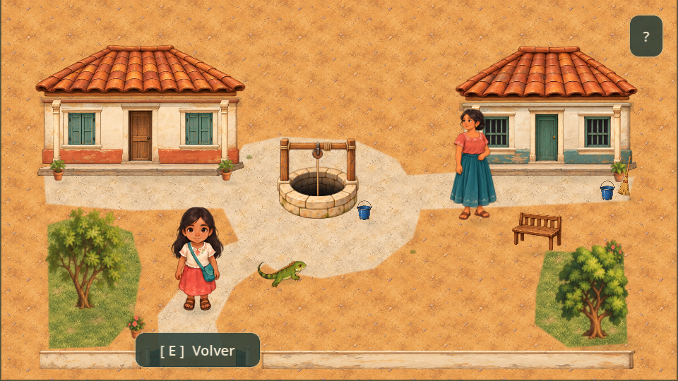

# Área comunitaria: pozo

La calle comparte la dirección ilustrada del patio. La plazoleta irregular y el camino desde el portón conducen hacia un pozo cotidiano de piedra clara, abertura oscura y estructura sencilla de madera. No se añadieron símbolos ni efectos sobrenaturales.

## Recursos y organización

- `street_ground.gd` reutiliza el TileSet y los materiales del patio en seis TileMapLayer estáticos, sin física ni navegación.
- `street_presentation.gd` combina las casas modulares, árboles, plantas, macetas, banca, cubeta, escoba y portón existentes. Las casas varían paredes, puertas, ventanas y dimensiones sin duplicar texturas.
- `street_well.gd` separa brocal posterior y frontal de la estructura de madera mediante Y-sorting. Es estático y reutiliza la cubeta y las sombras del kit.
- `vecina_art.gd` presenta una ilustración estática con los pies en la posición original. Su vestimenta y motivos son provisionales y requieren revisión cultural con personas de la región.

El recurso nuevo de este reemplazo es `assets/street/well.png`; sus [prompts](well_generation.md) documentan la generación. La ilustración de la vecina ya existía. El atlas de la fuente anterior queda sin utilizar. Godot limita ambas texturas importadas a 512 píxeles y usa mipmaps. Las sombras reutilizan el sistema del patio; no hay luces adicionales, partículas ni shaders nuevos.

## Coordenadas conservadas

| Elemento | Posición o colisión original |
| --- | --- |
| Casa izquierda | Rect2(28, 52, 143, 65) |
| Casa derecha | Rect2(325, 52, 124, 65) |
| Brocal del pozo | Rect2(205, 115, 40, 40) |
| Interacción con pozo | Vector2(225, 153) |
| Vecina | Vector2(335, 156) |

La decoración no introduce obstáculos. Permanecen intactos movimiento, seguimiento de Gela, conversaciones, misión, cuaderno y guardado. `modern_street_enabled = false` conserva el dibujo anterior como alternativa técnica.

## Verificación

Ejecutar `godot --headless --path . --script res://tests/test_street_art.gd` para comprobar aislamiento de la presentación, terreno, profundidad, rutas y pozo estático. También pasan las pruebas de calle, encuentro con Gela, inicio narrativo, guardado, presentación y arte del patio.

Con F5, continuar la historia hasta salir del portón. Revisar acercamiento al pozo, conversación con la vecina y regreso. Se inspeccionaron capturas reales de Godot a 960×540, incluida la interfaz de diálogo; rendimiento y controles táctiles deben verificarse en un móvil real.
