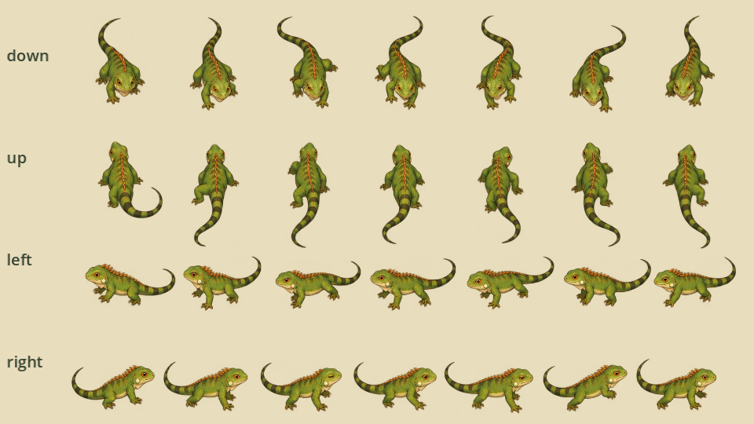
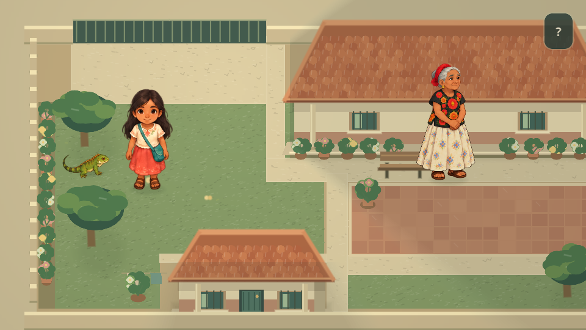

# Diseño ilustrado de Gela

Gela es una iguana verde de cuerpo alargado, patas cortas, vientre claro y cola larga con bandas. La cresta incorpora acentos cálidos discretos. El estilo ilustrado acompaña a Nisa y Bixhozegola; no incluye ropa, accesorios ni expresiones humanas.

## Recursos y animaciones

- `assets/characters/gela/gela_atlas.png`: PNG RGBA original de 1254×1254, generado con ImageGen integrada. Conserva la transparencia y los píxeles originales.
- `sprite_frames.tres`: 36 regiones con márgenes que producen lienzos uniformes de 512×512. `atlas_layout.json` documenta regiones, márgenes y el punto del suelo de cada dibujo; el resultado generado no tiene celdas perfectamente uniformes.
- `generation_prompt.md`: prompt exacto seleccionado y referencias de estilo.
- `scripts/presentation/gela_art.gd`: crea el `AnimatedSprite2D` y lee `facing`, `velocity` y `available`; no escribe el estado de la compañera.

Cada dirección (`down`, `up`, `left`, `right`) tiene `idle_*` con tres poses y `walk_*` con seis. El reposo usa 1.2 FPS con duraciones relativas 1.4, 0.18 y 1.4; la caminata usa 12 FPS, ajustados a la velocidad. Las patas y la cola cambian de pose. Una respiración de amplitud pequeña conserva el origen del suelo. No se rota ni refleja el dibujo para sustituir vistas.

## Escala y lógica

El origen virtual es `(256, 384)`, bajo el centro del cuerpo. La escala visual base es 0.18, con longitud de cuerpo y cabeza aproximada de 18 unidades; la cola amplía la silueta. La escala del actor permanece en uno, con colisión circular de radio 4. Se conserva el controlador de seguimiento, la distancia de descanso y la pausa durante diálogos. El dibujo procedural anterior se retiró.

Gela aparece en `(66, 151)`, en el suelo debajo del árbol superior del jardín izquierdo, al cerrar la entrega del cuaderno. El saludo sigue activando el acompañamiento. Las partidas anteriores donde aún está oculta usan este punto; si ya apareció, se restaura su posición guardada. No cambia la versión del guardado.

## Verificación y próximos pasos

Ejecuta `godot --headless --path . --script res://tests/test_gela_art.gd`, además de las pruebas de compañera, guardado, calle y presentación. Comprueban direcciones, origen, colisión, aparición, seguimiento, pausa y continuidad entre zonas. La anatomía y la fluidez requieren revisión visual; el número de fotogramas no las garantiza. Revisa también contraste sobre césped y losetas, cambios diagonales y rendimiento en móvil.

Correr, dormir y gestos especiales quedan pendientes de una necesidad narrativa. La iguana es una interpretación artística; especie, colores y relación con el entorno deben verificarse con fuentes locales antes de afirmar fidelidad regional. El saludo y el seguimiento son ficción del juego.
