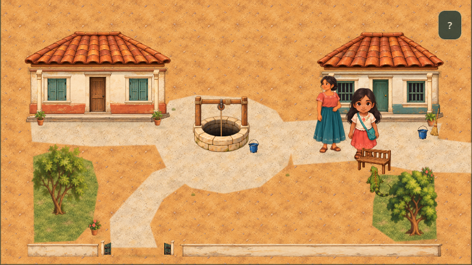
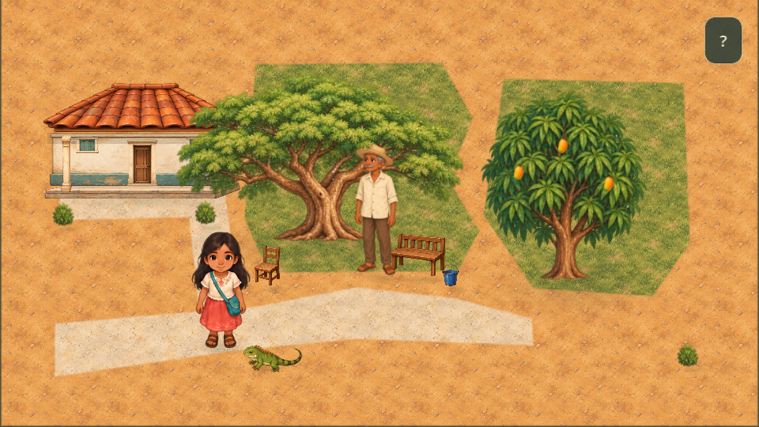
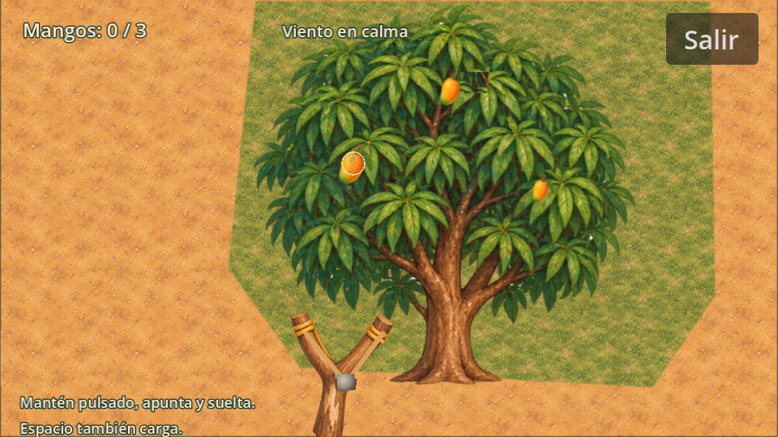

# Misión de Don Jacinto

La pista de Bixhozegola abre un recorrido breve: salir al pozo, seguir el sendero a la derecha hasta el borde: la transición a Jacinto es automática. También se conserva «Ir con don Jacinto» como interacción accesible. El regreso usa el borde izquierdo del sendero de Jacinto y conserva la dirección de Nisa. La tercera zona comparte `scenes/main.tscn` y conserva el controlador y diseño de Nisa y el seguimiento de Gela.

## Recorrido narrativo

1. Hablar con Don Jacinto, bajo el huanacaxtle. Reconoce el cuento pero no logra recordar la palabra.
2. Acercarse al claro frente al **otro árbol**, el palo de mango, y elegir «Usar resortera».
3. Bajar tres mangos. Nisa ayuda mientras Gela observa; la iguana no resuelve la actividad ni habla.
4. Volver a hablar con Jacinto. Recuerda a su madre contando el relato bajo el huanacaxtle y el contexto en que usaba la palabra.
5. Regresar al pozo por la salida inferior izquierda, entrar al patio y compartir la pista con Bixhozegola.

La anotación permanece como **[PENDIENTE_DE_VERIFICACION]**. El contexto del relato es ficción, no una tradición zapoteca documentada. La misión no completa la palabra ni el misterio.

## Resortera

El minijuego abre `scenes/slingshot_minigame.tscn`, una pantalla propia con árbol ampliado, resortera de madera en primer plano, gomas móviles y piedra cargada. Se reutilizan los PNG existentes: el marco se muestra con un recorte nativo de Godot, sin regenerar imágenes.

Mantener el botón izquierdo del mouse o un dedo carga la potencia; mover o arrastrar ajusta la mira; soltar dispara. **Espacio** también carga al mantenerlo y dispara al soltarlo; las flechas permiten ajustes finos. **Salir** o **Escape** vuelve al mapa mediante un fade. Las piedras son ilimitadas.

El vuelo usa una curva calculada: la potencia modifica alcance, altura y duración. Puntos discretos durante la carga anticipan la trayectoria; una piedra y su estela muestran el disparo. El primer mango es mayor; el segundo está más alto y parcialmente cubierto por follaje; el tercero es menor. Se balancean suavemente. Después de dos aciertos aparece viento suave, cuyo sentido se muestra arriba y cuya desviación es pequeña.

Ramas y tronco tienen sonidos distintos. Las ramas se sacuden y desprenden unas hojas; los mangos caen, rebotan y quedan en el suelo. Al conseguir tres, se observan brevemente antes de volver al mapa y habilitar la conversación. Gela permanece en el mapa sin interferir. No se modifica la cámara: la presentación propia usa CanvasLayer y la salida restaura movimiento e inputs. Cancelar o cerrar durante la actividad conserva HELP para poder repetirla.

## Arquitectura y persistencia

- `patio_story.gd` conserva el diálogo existente y añade `JacintoProgress`: SEARCH, HELP, MANGOS_DOWN, MEMORY_RECEIVED y SHARED. La pista de la abuela activa SEARCH; el apuntado es un estado temporal del minijuego.
- `scenes/slingshot_minigame.tscn` y `slingshot_minigame.gd` encapsulan fondo, árbol, objetivos, resortera, proyectil, viento, UI, audio y señal de finalización. Posiciones, tamaños, radios, origen, ilustraciones y viento son parámetros exportados para reutilización. El procesamiento se pausa fuera del modo. F6 permite previsualizarlo de forma independiente.
- `jacinto_presentation.gd`, `jacinto_ground.gd` y `jacinto_assets.gd` combinan el kit reutilizado y dos [PNG nuevos con prompts documentados](jacinto_generation.md).
- `world.gd` activa las colisiones de casa y troncos solo en esta zona y restaura las del patio/pozo al regresar. Las copas no bloquean el paso. La casa ocupa Rect2(30,60,120,58); los troncos Rect2(192,138,20,16) y Rect2(350,166,14,12).
- El campo opcional `jacinto_progress` conserva versión 2 y vale cero en partidas antiguas. Se guarda al cerrar el primer diálogo, completar los tres mangos, cerrar el recuerdo y compartirlo con la abuela. Una interrupción de apuntado reinicia solo la actividad; un diálogo incompleto puede repetirse.

## Verificación

`godot --headless --path . --script res://tests/test_jacinto.gd` comprueba activación, bloqueo del recuerdo, acceso y regreso, apuntado táctil/teclado, fallos, reintentos, tres aciertos, retorno del movimiento, diálogos interrumpidos y persistencia. Pasan además las pruebas existentes de pista, calle, guardado, apertura, presentación, arte del patio, arte de calle y guía de Gela.

`godot --headless --path . --script res://tests/test_slingshot_mode.gd` comprueba bordes, orientación, pantalla propia, carga táctil, dedos adicionales, trayectoria curva, potencia, viento, impactos, caída y restauración.

Se revisaron capturas reales de Godot a 960×540 para zona, diálogo y apuntado. Falta validar controles táctiles, rendimiento y audio en un móvil real.
