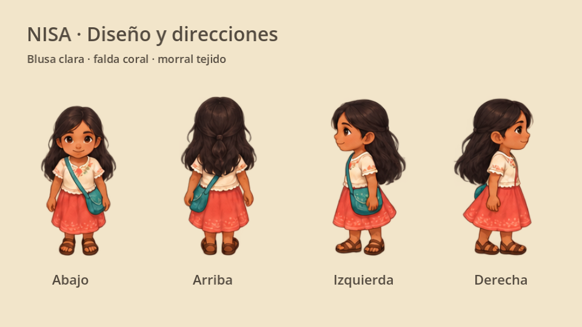
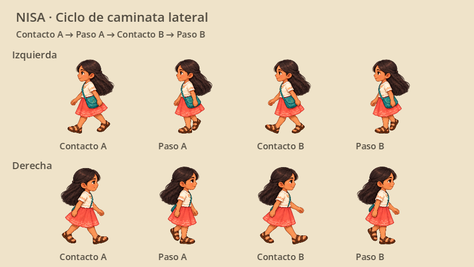

# Diseño visual de Nisa

Niña protagonista de aproximadamente 9–11 años, con cabello largo oscuro y ligeramente ondulado, rostro expresivo, blusa crema con pequeños detalles florales, falda coral sencilla, sandalias y morral tejido turquesa. El morral va en su cadera izquierda y conserva ese lado en las cuatro vistas; al mirar a la derecha queda parcialmente detrás del cuerpo.



[Vista de Nisa dentro del patio](nisa_gameplay.png).

## Integración

Antes de este cambio, Nisa se dibujaba por código: no había `AnimatedSprite2D`, `AnimationPlayer`, atlas ni nombres de animación existentes. El nuevo `AnimatedSprite2D` se crea dentro de la capa visual `HumanArt`, conservando la referencia `player.human_art`. `nisa_art.gd` lee `facing`, `velocity` y `can_move` del controlador y selecciona la animación; no escribe en ellos.

El cuerpo `CharacterBody2D`, su escala **1**, la colisión circular de radio **6.5**, la velocidad **78**, los límites, el movimiento, las interacciones y los diálogos conservan su funcionamiento. La función `_physics_process` y `scenes/player.tscn` se verificaron idénticas a las anteriores al rediseño. Nisa mantiene la misma identidad al pasar entre patio y calle.

Los atlases RGBA miden **1536×1024**. El original conserva el reposo en las cuatro direcciones y las caminatas verticales; un segundo atlas corrige únicamente las caminatas laterales. El atlas original usa un lienzo virtual **320×320**, con los pies en **(160, 304)**; el lateral usa **640×640**, con los pies en **(320, 608)**. Los metadatos de `AtlasTexture` indican origen y altura de referencia para que ambas resoluciones conserven una altura aproximada de **74–80 unidades** en el mundo. Las regiones y márgenes compensan las posiciones sin recortar ni retocar los PNG. Se usa filtro lineal y sombra independiente. El patio incluye un pequeño margen superior de cámara para evitar cortar el cabello junto al portón.

## Animaciones listas

| Direcciones | Nombres | Fotogramas | Velocidad |
| --- | --- | --- | --- |
| Abajo, arriba, izquierda, derecha | `idle_down`, `idle_up`, `idle_left`, `idle_right` | 2 por dirección | 2 FPS |
| Abajo, arriba, izquierda, derecha | `walk_down`, `walk_up`, `walk_left`, `walk_right` | 4 por dirección | 7 FPS |

Las vistas izquierda y derecha tienen fotogramas propios: no se reflejan con `flip_h`, para conservar la posición del morral. Al detenerse, Nisa mantiene la última orientación. Durante los diálogos permanece en reposo; el selector admite futuras animaciones `talk_*` cuando se incorporen al recurso.

## Caminata lateral

La corrección sustituye los cuatro dibujos de cada caminata lateral por un ciclo completo: contacto con la pierna cercana adelantada, paso de la pierna lejana, contacto con la pierna lejana adelantada y paso de la pierna cercana. La secuencia original repetía variaciones de una misma zancada. Se conservan los nombres, los cuatro fotogramas por ciclo y los 7 FPS, sin cambios en el controlador.



`lateral_walk_layout.json` registra las ocho regiones que reemplazan a las caminatas izquierda y derecha del atlas original. La lámina lateral tiene cuatro columnas y dos filas, con una dirección por fila. El anclaje horizontal mantiene la cabeza respecto al reposo para evitar saltos al empezar a caminar; el vertical se alinea al apoyo de las sandalias. El selector adapta solamente la geometría visual cuando cambia de atlas.

## Recursos editables

- [`nisa_atlas.png`](../assets/characters/nisa/nisa_atlas.png): imagen fuente transparente seleccionada.
- [`nisa_lateral_walk_atlas.png`](../assets/characters/nisa/nisa_lateral_walk_atlas.png): corrección de las caminatas izquierda y derecha, manteniendo el diseño y el morral en su lado anatómico.
- [`sprite_frames.tres`](../assets/characters/nisa/sprite_frames.tres): ocho animaciones, regiones y márgenes, editables como `SpriteFrames` en Godot.
- [`atlas_layout.json`](../assets/characters/nisa/atlas_layout.json): registro del atlas original; [`lateral_walk_layout.json`](../assets/characters/nisa/lateral_walk_layout.json) reemplaza sus ocho entradas de caminata lateral en el recurso actual.
- [`nisa_art.gd`](../scripts/presentation/nisa_art.gd): selector y sombra; conserva el controlador del jugador.
- [`generation_prompt.md`](../assets/characters/nisa/generation_prompt.md): solicitudes exactas de generación y corrección con la herramienta integrada `image_gen`.
- [`lateral_walk_prompt.md`](../assets/characters/nisa/lateral_walk_prompt.md): prompts de la corrección de las piernas, las sandalias y las poses de paso.

Posteriormente pueden añadirse `run_*`, `talk_*`, `pick_up_*`, `sit_*`, `surprise_*`, `joy_*`, `sad_*` y `fear_*`, usando las mismas cuatro direcciones y el mismo origen. Estos nombres son una convención propuesta, no animaciones ya creadas. Las nuevas acciones deben conectarse a la capa visual cuando se desarrollen sus comportamientos correspondientes.

## Verificar

```sh
godot --headless --path . --script res://tests/test_nisa_art.gd
```

Comprueba además las pruebas de presentación, Gela, guardado y calle. Para revisar los fotogramas individualmente, abre `sprite_frames.tres` en Godot; ejecuta el proyecto para ver escala, luz y superposición reales. Valida también legibilidad y suavidad en un dispositivo móvil.

Los detalles bordados y el tejido del morral son propuestas gráficas provisionales. Deben verificarse con referencias de comunidades específicas del Istmo y con personas de la región antes de atribuirlos a diseños tradicionales concretos. El cambio no añade traducciones, costumbres ni afirmaciones culturales a la historia.
