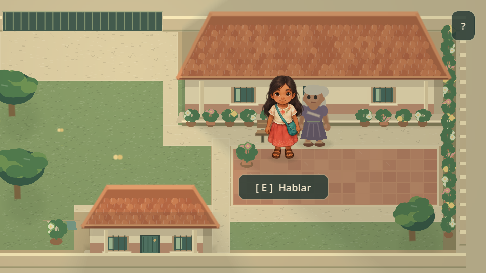
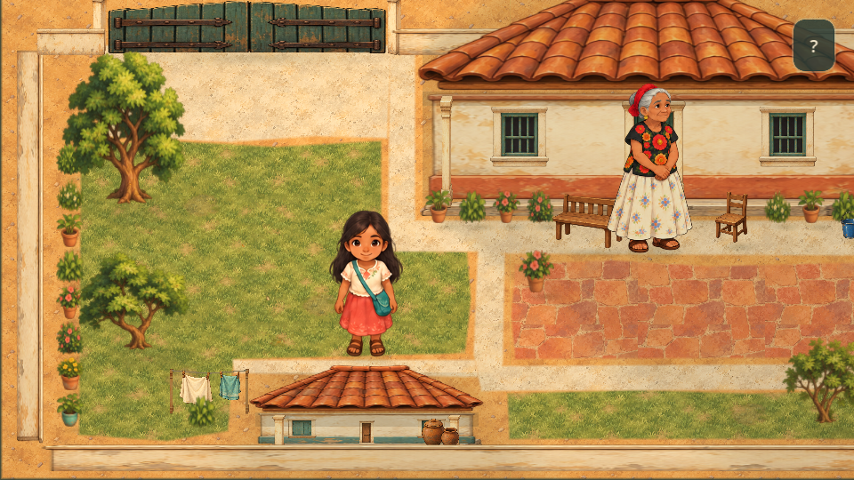
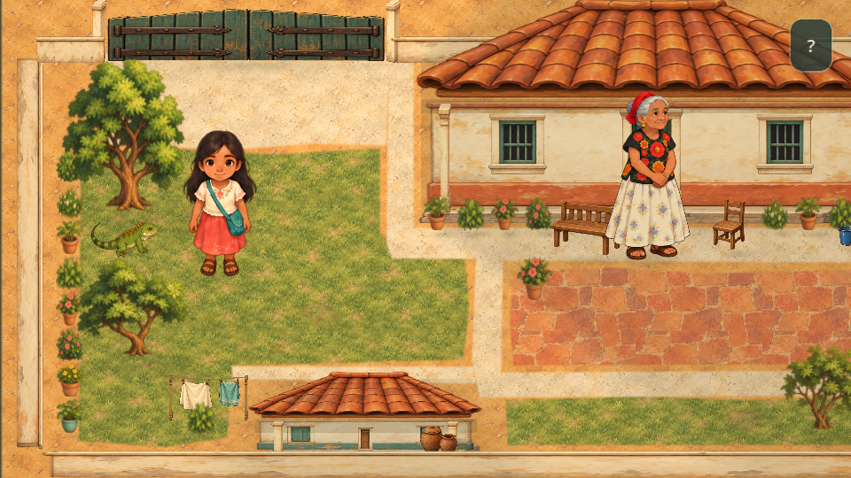

# Presentación ilustrada del patio

Primera escena de referencia artística de BINNI: suelo pintado, árboles orgánicos, casas por capas y objetos domésticos. Conserva la distribución y función jugable del patio. La [calle y su fuente](fountain_visual.md) reutilizan el mismo kit ilustrado. Consulta [la auditoría inicial](patio_audit.md) para revisar nodos, colisiones y coordenadas preservadas.



## Probar y revisar

Ejecuta `scenes/main.tscn` con F5. Nisa inicia junto a su casa, observa el cielo extraño y pregunta a la abuela; entrega el cuaderno y encuentra a Gela debajo del árbol superior izquierdo. Consulta [el inicio narrativo](story_opening.md) para recorrer el primer recuerdo. Los dibujos de los personajes y controles conservan su funcionamiento. Activa `preview_touch_controls` para revisar las flechas en computadora; la interacción táctil requiere eventos de pantalla táctil.

Camina delante y detrás de los árboles y alrededor de las casas. Los troncos y props usan su base para Y-Sorting. Las copas se suavizan cuando tapan a Nisa y recuperan su opacidad al pasar delante. El tejado principal también puede suavizarse cuando su proyección cruza su silueta. La casa pequeña usa una proyección más baja para dejar libre el punto inicial `(184, 208)`. No cambia su colisión.

Consulta también la [captura de oclusión detrás del árbol](patio_occlusion.png).



## Suelo y recursos reutilizables

`assets/patio/` contiene cuatro PNG originales generados con ImageGen integrada: materiales, vegetación, arquitectura y detalles. No existe una imagen del mapa completo. Los prompts exactos están en [generation_prompts.md](../assets/patio/generation_prompts.md); `atlas_layout.json` y `patio_assets.gd` registran las regiones reales, porque las láminas generadas no tienen celdas perfectamente uniformes.

`ground_tileset.tres` ofrece cuatro materiales con 16 variantes cada uno: césped, tierra, piedra clara y barro. `patio_ground.gd` usa siete `TileMapLayer` estáticos con celdas de **16×16** unidades. Los fragmentos contiguos mantienen la continuidad de las pinceladas. Sus máscaras `Polygon2D` tienen bordes irregulares y una transición de 1.4 unidades. Pequeños parches secos, piedras, hojas y flores aportan variación. Los tiles no tienen capas físicas ni navegación; Gela conserva su cuadrícula existente.

Los atlas tienen mipmaps. Suelo y vegetación usan filtrado con mipmaps para reducir el parpadeo al dibujarlos pequeños; los elementos arquitectónicos usan filtro lineal para conservar sus contornos.

## Props y casas

- `scenes/props/patio_prop.tscn` y `patio_prop.gd`: plantilla parametrizable por `kind`, `extent` y `seed_value`. Incluye tres árboles, arbustos, hierba, flores, cinco macetas, banco, silla, cubeta, escoba, vasijas, muros, portón, cuaderno y tendedero. En árboles, `extent` indica ancho/alto visual; en plantas, controla su tamaño. No ejecuta `_process` ni crea colisiones.
- Cada árbol separa `TreeBase/Trunk` de `TreeCanopy/Leaves`, con regiones del mismo PNG y un origen común. Las variantes tienen tamaños adecuados a los objetivos cercanos; las copas inferiores dejan visibles a Gela y al cuaderno.
- `scenes/props/patio_house.tscn` y `patio_house.gd`: fachada con `WallBase`, `Openings`, `PorchSupports`, corredor, sombra de alero y `Roof` independiente. La casa principal conserva su base `(328, 130)` y anchura 232; la pequeña mantiene `(184, 252)` y anchura 112. Tejas, puertas y ventanas son piezas compartidas, no una fachada aplanada en el fondo del mapa.
- `patio_assets.gd`: caché de regiones `AtlasTexture`, creación de sprites y una textura de sombra suave compartida. Las sombras se colocan sobre el suelo con `z_index = -5`; no son colisiones.

Las plantillas construyen sus hijos visuales al entrar en la escena. La composición activa se define en `patio_presentation.gd`; para revisar el conjunto usa F5 y las capturas de esta guía. No edites las coordenadas de narrativa o los cuerpos físicos para ajustar el arte.

## Luz y ambiente

Se conserva la luz cálida diurna existente: un `CanvasModulate`, un `PointLight2D` con sombras suaves y oclusores de las casas. `daylight` en `patio_lighting.gd` permite ajustar la intensidad; no hay ciclo horario. `patio_sky.gd` compone el horizonte superior con un gradiente y una franja pálida fragmentada mediante `Line2D`, detrás de muros y tejados. Tras compartir el primer fragmento, aclara los colores y separa suavemente la franja. La cámara muestra el cielo durante la observación inicial y al notar el regreso de la brisa; luego recupera su seguimiento habitual.

`patio_ambience.gd` centraliza el movimiento de tres copas, dos telas, dos hojas y una mariposa pequeña a **12 actualizaciones por segundo**. Cambia transformaciones, sin `queue_redraw()` continuo. El viento está detenido hasta que `street_progress` llega a 3: copas y telas quietas, hojas ocultas. Después vuelve una brisa discreta. La mariposa usa dos poses en `AnimatedSprite2D` y mantiene su actividad durante la quietud. El ambiente se pausa fuera del patio; el suelo y los demás props permanecen estáticos. No hay emisores de partículas, shaders nuevos ni luces por objeto.



## Verificación

Con Godot 4.7 en el PATH:

```sh
godot --headless --path . --script res://tests/test_patio_art.gd
godot --headless --path . --script res://tests/test_presentation.gd
godot --headless --path . --script res://tests/test_companion.gd
godot --headless --path . --script res://tests/test_save.gd
godot --headless --path . --script res://tests/test_street.gd
godot --headless --path . --script res://tests/test_story_opening.gd
```

Las pruebas verifican capas, variantes, ausencia de colisiones nuevas, posiciones, rutas, oclusión, punto inicial, pausa ambiental, diálogos, guardado y transiciones. Revisa además legibilidad a 480×270, cuaderno/portón, contacto delante/detrás, ayuda contextual y controles táctiles. Las capturas se renderizaron en Godot. La escena de revisión completa tiene aproximadamente 240 nodos y comparte cuatro atlas; el rendimiento y la memoria en un teléfono real todavía necesitan medición.

## Referencias pendientes

Este patio es una interpretación artística ficticia. Especies vegetales, tipos de construcción, mobiliario y motivos regionales requieren verificación con fotografías, fuentes de comunidades específicas del Istmo y personas de la región. Los nombres en diidxazá siguen siendo provisionales; no se añaden traducciones ni afirmaciones culturales.

Referencias técnicas: [TileMapLayer](https://docs.godotengine.org/en/stable/classes/class_tilemaplayer.html), [TileSetAtlasSource](https://docs.godotengine.org/en/stable/classes/class_tilesetatlassource.html), [CanvasItem: recorte y orden visual](https://docs.godotengine.org/en/stable/classes/class_canvasitem.html) y [luces 2D](https://docs.godotengine.org/en/stable/tutorials/2d/2d_lights_and_shadows.html).
