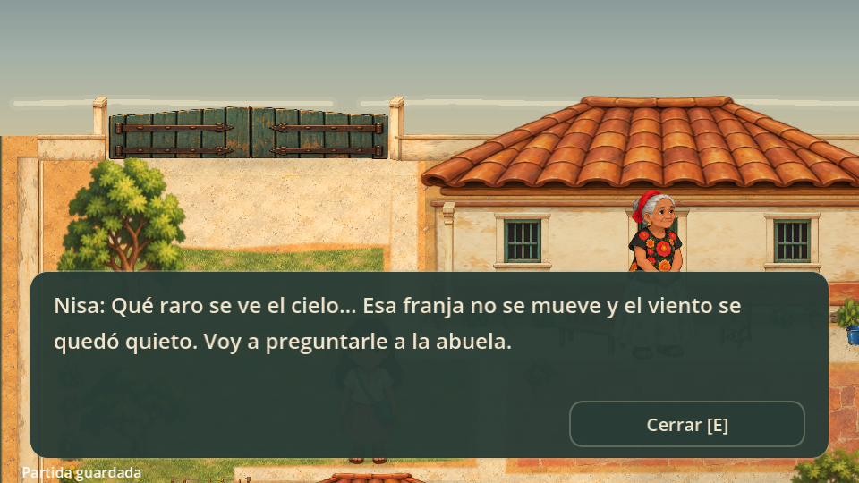
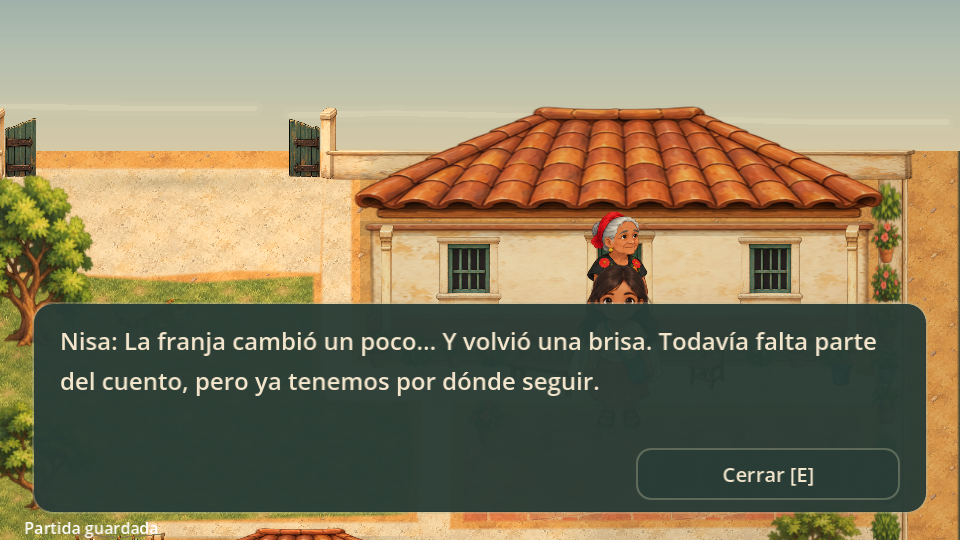

# Inicio: el cielo que se quedó quieto

Primera fase jugable de BINNI. El misterio nace de una observación de Nisa y se resuelve parcialmente escuchando y compartiendo recuerdos. Es un relato original y provisional del juego.



## Recorrido

1. **Cielo extraño.** Nisa inicia en `(184, 208)`, frente al centro de su casa. Una franja pálida permanece inmóvil en el horizonte; copas y telas no se mueven. Su breve observación encuadra el cielo. Cierra con **E** o el botón del diálogo para caminar.
2. **Pregunta a Bixhozegola.** La abuela recuerda que escuchaba un cuento sobre un cielo así, pero no cómo seguía. Pide el cuaderno para leerlo juntas.
3. **Cuaderno.** Sigue en `(398, 188)`. La página contiene un dibujo de la fuente y la frase «Cuando el cielo se detiene, las voces...». Falta una palabra en diidxazá y la continuación del cuento. Nisa pregunta cómo encontrar lo que falta; un crujido y unas hojas que se mueven anuncian algo debajo del árbol.
4. **Invitación de Gela.** Aparece en el suelo al terminar la entrega. Nisa se acerca y Gela mira hacia el portón. «¿Quieres que te siga?». Bixhozegola le pide que vaya con cuidado y vuelva para contarle qué encontraron. Gela avanza hacia el portón y espera cuando Nisa se queda atrás. Interactúa para salir; no hace falta otra visita a la abuela.
5. **Fuente y vecina.** En la calle, Gela conduce a Nisa hasta la fuente. Al examinarla, Nisa reconoce el dibujo y pregunta cómo supo que debían ir allí. Desde ese momento Gela retoma su seguimiento habitual. La vecina aporta: «...encuentran su camino cuando alguien vuelve a escucharlas». Recuerda que de niñas contaban el cuento entre varias personas.
6. **Primer fragmento.** Regresa con Bixhozegola y comparte lo escuchado. Al cerrar la conversación, el cielo se aclara un poco y vuelve una brisa. Una breve observación de Nisa vuelve a encuadrar el cielo para mostrarlo. El cuaderno conserva el fragmento; la palabra sigue pendiente.

La recuperación es parcial. Este tramo abre la búsqueda de otras voces del pueblo y no completa todavía el relato ni presenta Lidxi Gula.



## Código y guardado

- `patio_story.gd` conserva los cuatro estados del cuaderno y los pasos de la salida. Los diálogos nuevos usan esas transiciones existentes.
- `save_session.gd` muestra la observación inicial después de elegir Nueva partida o Continuar cuando `stage == MEET`. No guarda líneas leídas: una conversación interrumpida se puede repetir.
- `patio_sky.gd` presenta el cielo detrás de muros y tejados. `patio_camera.gd` cambia el encuadre durante las observaciones del cielo al inicio y tras el primer fragmento; después sigue a Nisa como antes.
- `patio_presentation.gd` deriva cielo y viento de `street_progress >= 3`. `patio_ambience.gd` mantiene el límite de 12 Hz y pausa fuera del patio.

El formato sigue en **versión 2**, sin campos nuevos. El fragmento solo se confirma al cerrar la conversación final con Bixhozegola, antes de la observación de la brisa. Partidas anteriores conservan el cuaderno, Gela, posiciones y zona; un paseo ya terminado corresponde a este primer fragmento. Usa Nueva partida para ver el inicio completo. El menú pide confirmar antes de reemplazar tu guardado.

El movimiento de Nisa, las colisiones, rutas y el arte de los personajes se conservan. `gela.gd` añade una guía temporal a 54 unidades por segundo, con esperas a 68 unidades y separación cuando Nisa se acerca demasiado al lugar de espera. `patio_story.gd` deriva la guía del progreso existente: patio sin pista del portón y calle sin fuente examinada. Continuar recupera la guía sin añadir campos al guardado. Después de examinar la fuente conserva su seguimiento habitual.

`gela_encounter.gd` presenta el crujido con audio generado localmente y tres hojas durante 0.65 segundos. Es un movimiento provocado por Gela, separado del viento detenido. No añade colisiones y permanece inactivo fuera del efecto. No se confirma aún si Gela percibe algo relacionado con Lidxi Gula; su conducta es ficción del juego.

## Referencias culturales pendientes

La franja del cielo y las frases en español son ficción escrita para BINNI, no una leyenda o explicación cultural documentada. La flor azul ya no sostiene esta pista. No se añadió una traducción para la palabra ausente.

Antes de incorporar vocabulario o relatos reales, verificar con hablantes y fuentes de la comunidad: variante de diidxazá, escritura, significados, nombres provisionales y contexto de los relatos. Evitar que la memoria perdida se atribuya solamente a la edad: distintas personas guardan partes del cuento.

## Verificación

```sh
godot --headless --path . --script res://tests/test_story_opening.gd
godot --headless --path . --script res://tests/test_save.gd
godot --headless --path . --script res://tests/test_street.gd
godot --headless --path . --script res://tests/test_gela_intro.gd
```

La prueba de apertura recorre el fragmento completo, interrumpe y recupera diálogos, comprueba la cámara y verifica que cielo y brisa se restauren únicamente después de confirmar el recuerdo. Revisar además el encuadre y los diálogos a 480×270, la tecla E y el botón de avance. Las pruebas usan archivos aislados.
